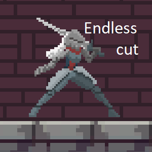

# Rigid-Jam-1
[Rigid Jam #1: The 1 hour game jam.](https://itch.io/jam/rigidjam)  
Theme: Endless Void  
Endless cut - 2d slasher, where your sword want to kill you

# Downloads and Links
Available in [Windows, OSX, Linux and Web](https://itch.io/jam/rigidjam). If you encounter any problem, please leave a issue! 

# How to play:
 * Keyboard:
   * A/D - move 
   * W - jump
   * Space/K - attack. Your cuts will stay in air, and call kill you
   * Q/E or J/L - dash left/rigt. You are invulnerable while dash
   * R - restart (use if you face some bug)
 * Gamepad:
   * D-pad left/right - move 
   * D-pad up - jump
   * A - attack. Your cuts will stay in air, and call kill you
   * LB/RB - dash left/rigt. You are invulnerable while dash
   * X - restart (use if you face some bug)
 * Actually, there are in-game tutorial

# What is Rigid Jam?
Just a one more 1-hour jam, hosted by [member](https://discordapp.com/invite/2vkeudT) of [TriJam](https://discordapp.com/invite/DScpGwU) community

# Used assets:
 * 

# Screenshots

